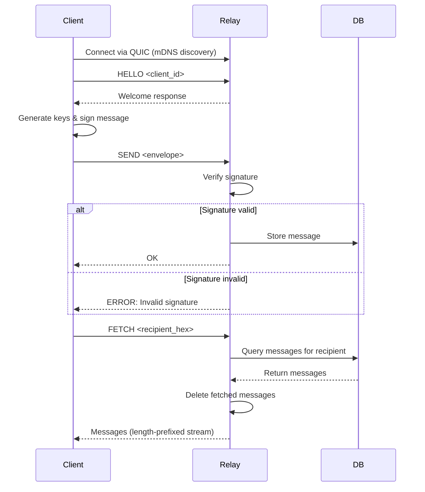
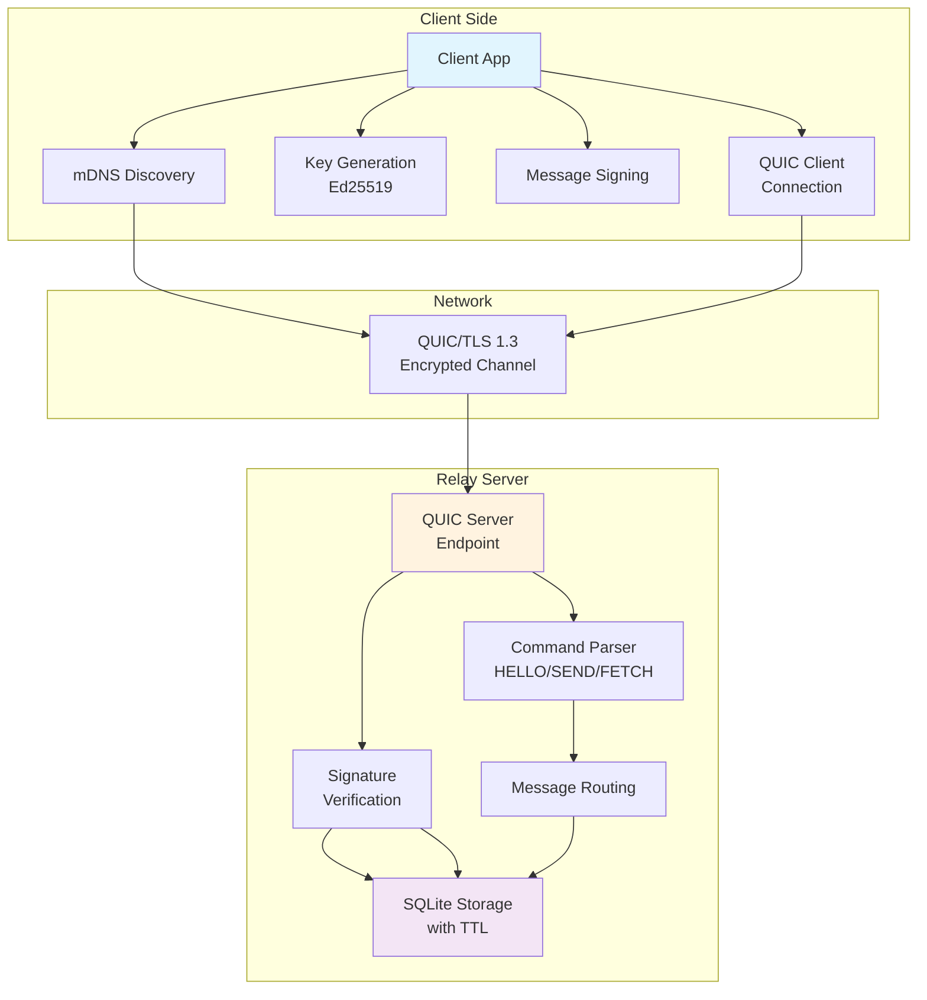

# Qight — Secure QUIC-Based Messaging Relay

[](https://www.rust-lang.org/)
[](LICENSE)
[](https://crates.io/crates/qight)

**Qight** is a lightweight, secure messaging relay built on QUIC (HTTP/3) for low-latency, authenticated communication. It enables clients to send and receive ephemeral messages through a central relay server, with end-to-end signing for authenticity. Perfect for IoT, decentralized apps, or secure event-driven systems.

## Features

- **QUIC Transport**: Fast, encrypted connections over UDP using TLS 1.3.
- **Message Signing**: Ed25519-based signatures ensure message authenticity and prevent tampering.
- **SQLite Storage**: Persistent message storage with TTL-based expiration.
- **Service Discovery**: Automatic relay discovery via mDNS (Bonjour/Avahi).
- **Offline Queuing**: Clients queue messages locally when disconnected.
- **Async Architecture**: Built with Tokio for high concurrency.
- **Cross-Platform**: Runs on Linux, macOS, Windows.

## Table of Contents

- [Installation](#installation)
- [Quick Start](#quick-start)
- [Architecture](#architecture)
- [API Reference](#api-reference)
- [Security](#security)
- [Contributing](#contributing)
- [License](#license)

## Installation

### Prerequisites
- Rust 1.70+
- SQLite (bundled via `rusqlite`)

### Add to Your Project
```toml
[dependencies]
qight = { git = "https://github.com/idorocodes/qight.git"}
```

### Build from Source
```bash
git clone https://github.com/idorocodes/qight.git
cd qight
cargo build --release
```

## Quick Start

### 1. Run the Relay Server
```bash
cargo run --bin relay
```
The server listens on `127.0.0.1:4433` and advertises via mDNS.

### 2. Run the Demo Client
```bash
cargo run --bin qight_demo
```
This connects, sends a signed message, and fetches it back.

### 3. Use in Your Code

#### Client Example
```rust
use qight::{RelayClient, MessageEnvelope};
use qight::gen_keypair;
use mdns_sd::{ServiceDaemon, ServiceEvent};
use std::net::IpAddr;

#[tokio::main]
async fn main() -> anyhow::Result<()> {
    // Discover relay via mDNS
    let mdns = ServiceDaemon::new()?;
    let service_type = "_qight._udp.local.";
    let receiver = mdns.browse(service_type)?;
    
    let addr = loop {
        if let Ok(ServiceEvent::ServiceResolved(info)) = receiver.recv_async().await {
            if let Some(addr) = info.get_addresses_v4().first() {
                break SocketAddr::new(IpAddr::V4(*addr), info.get_port());
            }
        }
    };

    // Connect to relay
    let client = RelayClient::connect(addr).await?;

    // Say hello
    client.hello("my-client").await?;

    // Generate keys
    let (recipient_key, _) = gen_keypair();
    let (sender_pub, sender_priv) = gen_keypair();

    // Create and sign a message
    let mut envelope = MessageEnvelope::new(
        "alice".to_string(),
        recipient_key,
        sender_pub,
        b"Hello, world!".to_vec(),
        3600, // 1 hour TTL
    );
    envelope.sign(&sender_priv);

    // Send it
    client.send(&envelope).await?;

    // Fetch messages for recipient
    let messages = client.fetch(&hex::encode(recipient_key)).await?;
    for msg in messages {
        println!("From {}: {}", msg.sender, String::from_utf8_lossy(&msg.payload));
    }

    client.close(Some("done")).await;
    Ok(())
}
```

#### Server Example
```bash
cargo run --bin relay
```
The server listens on `127.0.0.1:4433` (change to `0.0.0.0:4433` for network access) and handles connections.

## Architecture

### Components
- **Relay Server** (`relay` binary): Central hub handling connections, storage, and message routing.
- **Client Library** (`qight` crate): API for connecting, sending, and fetching messages.
- **Message Envelope**: Structured message format with signing.
- **Key Management**: Ed25519 utilities for signing/verification.

### Message Flow


### Architecture


### Storage
- **SQLite Database**: `quic.db` for messages, `qight_outbox.db` for client queues.
- **Expiration**: Messages auto-delete after TTL.

##  API Reference

### RelayClient
- `connect(addr: SocketAddr)`: Connect to relay at address.
- `hello(client_id: &str)`: Handshake.
- `send(envelope: &MessageEnvelope)`: Send signed message.
- `fetch(recipient_hex: &str)`: Fetch messages for recipient (hex-encoded key).
- `close(reason: Option<&str>)`: Disconnect.

### MessageEnvelope
- `new(sender, recipient, sender_key, payload, ttl)`: Create envelope.
- `sign(&mut self, private_key)`: Sign payload.
- `verify(&self)`: Verify signature.
- `to_bytes()` / `from_bytes(bytes)`: Serialize/deserialize.

### Key Functions
- `gen_key()`: Random 32-byte key.
- `gen_keypair()`: (public, private) Ed25519 keys.
- `sign_message(priv, msg)`: Sign bytes.
- `verify_message(pub, msg, sig)`: Verify signature.

##  Security

- **Transport Security**: QUIC with TLS 1.3 (self-signed certs for testing).
- **Message Authenticity**: Ed25519 signatures prevent tampering.
- **No Encryption**: Payloads are signed but not encrypted—add AES for confidentiality.
- **Key Management**: Clients handle keys; relay doesn't store them.
- **Denial of Service**: Basic rate limiting recommended for production.

**Warning**: Use strong keys and avoid self-signed certs in production. Implement authentication for real deployments.

##  Testing

Run tests:
```bash
cargo test
```

Includes unit tests for signing, serialization, DB ops, and integration tests.

##  Contributing

1. Fork the repo.
2. Create a feature branch: `git checkout -b feature-name`.
3. Make changes, add tests.
4. Run `cargo fmt` and `cargo clippy`.
5. Submit a PR.


## License

MIT License. See [LICENSE](LICENSE) for details.

---

Built with ❤️ in Rust. Questions? Open an issue!
     
